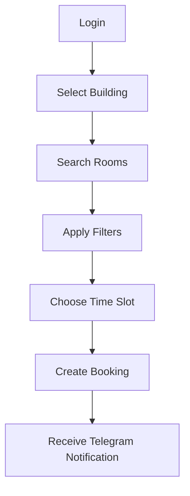
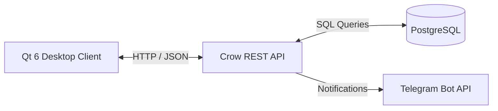
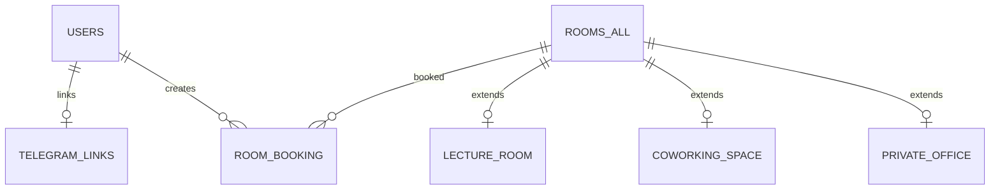
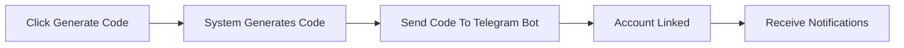

<p align="center">
  
</p>

<h1 align="center">RoomSched</h1>

<p align="center">
Smart Workspace Booking System
</p>

<p align="center">


</p>

<p align="center">
🇷🇺 <a href="./README.md">Русская версия</a>
</p>

---

## About The Project

**RoomSched** is a desktop workspace booking system developed by students of HSE University (Saint Petersburg) as part of a C++ course project.

The application is designed to simplify the process of finding and booking rooms within educational institutions, office buildings, coworking spaces, and business centers.

RoomSched allows users to browse available rooms, create bookings for specific time slots, manage their reservations, and receive notifications through Telegram.

The architecture of the project makes it suitable for integration into various organizations with minimal modifications.

---

## Table of Contents

* [Features](#features)
* [Screenshots](#screenshots)
* [User Workflow](#user-workflow)
* [Architecture](#architecture)
* [Technology Stack](#technology-stack)
* [Project Structure](#project-structure)
* [Database](#database)
* [Telegram Integration](#telegram-integration)
* [REST API](#rest-api)
* [Installation and Launch](#installation-and-launch)
* [Testing](#testing)
* [Environment Variables](#environment-variables)
* [Team](#team)
* [License](#license)

---

# Features

### 📅 Room Booking

Create reservations for selected dates and time intervals with server-side availability validation.

### 🏢 Multi-Building Support

The system supports multiple buildings and room collections.

### 🔍 Advanced Filtering

Search and filter rooms based on available criteria.

### 📋 Booking Management

View and cancel existing reservations directly from the application.

### 📨 Telegram Notifications

Receive booking creation and cancellation notifications through Telegram.

### 🔐 User Authentication

User registration and login functionality.

### ⚡ REST API

The desktop client communicates with the backend using a REST API built on Crow.

---

# Screenshots

## Login Window

```text
assets/register.png
assets/entry.png
```

---

## Main Menu

```text
assets/main.png
assets/rooms.png
```

---

## Room Search and Booking

```text
assets/bookings.png
```

---

## My Bookings

```text
assets/my_bookings.png
```

---

## Telegram Integration

```text
assets/tg.png
```

---

# User Workflow



---

# Architecture

RoomSched follows a classic client-server architecture.

* Qt is responsible for the desktop user interface.
* Crow provides REST API endpoints.
* PostgreSQL stores application data.
* Telegram Bot API delivers user notifications.



---

# Technology Stack

| Technology    | Purpose                   |
| ------------- | ------------------------- |
| C++20         | Main programming language |
| Qt 6          | Desktop user interface    |
| Crow          | REST API backend          |
| PostgreSQL    | Database                  |
| libpqxx       | PostgreSQL client library |
| jwt-cpp       | JWT authentication        |
| bcrypt        | Password hashing          |
| nlohmann/json | JSON processing           |
| cpr           | HTTP client               |
| Docker        | Backend deployment        |
| CMake         | Build system              |
| Git / GitHub  | Version control           |

---

# Project Structure

```text
RoomSched
│
├── backend
│   ├── common
│   │
│   ├── database
│   │   ├── db_sql
│   │   ├── include
│   │   │   ├── core
│   │   │   ├── models
│   │   │   ├── repositories
│   │   │   └── services
│   │   │
│   │   └── src
│   │       ├── core
│   │       ├── repositories
│   │       └── services
│   │
│   └── server
│       ├── include
│       │   ├── handlers
│       │   └── utils
│       │
│       └── src
│
├── frontend
│   └── client
│       ├── api
│       └── ui
│           ├── auth
│           ├── bookings
│           ├── menu
│           ├── register
│           ├── rooms
│           ├── side_panel
│           └── telegram
│
└── docker-compose.yml
```

---

# Database

Core entities of the system:

* Users
* Rooms
* Bookings
* Telegram Links
* Buildings



---

# Telegram Integration

Users can link their Telegram account to their RoomSched profile and receive notifications about booking events.

Linking process:



After linking, users receive notifications about:

* booking creation;
* booking cancellation.

---

# REST API

## Authentication

| Method | Endpoint     |
| ------ | ------------ |
| POST   | `/register`  |
| POST   | `/login`     |
| GET    | `/get_users` |

## Rooms

| Method | Endpoint      |
| ------ | ------------- |
| GET    | `/rooms`      |
| GET    | `/rooms/{id}` |

## Bookings

| Method | Endpoint               |
| ------ | ---------------------- |
| POST   | `/book-room`           |
| GET    | `/bookings`            |
| GET    | `/bookings/user/{id}`  |
| GET    | `/bookings/rooms/{id}` |
| POST   | `/booking/{id}/cancel` |

## Buildings

| Method | Endpoint     |
| ------ | ------------ |
| GET    | `/buildings` |

## Telegram

| Method | Endpoint         |
| ------ | ---------------- |
| POST   | `/telegram/link` |

---

# Installation and Launch

## Backend

All commands should be executed from the project root directory.

### First Build and Launch

```bash
docker compose up --build
```

### Launch Existing Backend

```bash
docker compose run --service-ports backend ./build/server/server
```

### Stop Containers

Database data will be preserved.

```bash
docker compose down
```

### Remove Containers and Database

```bash
docker compose down -v
```

### Connect To PostgreSQL

View active containers:

```bash
docker ps
```

Connect to the database:

```bash
docker exec -it <container_name> psql -U rsched_user -d roomsched
```

---

# Testing

### Backend Tests

```bash
docker compose run --service-ports backend ./build/tests/backend_tests
```

### E2E Tests

```bash
# add e2e test command here
```

---

# Launching The Client

Navigate to:

```bash
cd frontend/client
```

## Linux

Build:

```bash
cmake -S . -B build
cmake --build build
```

Run:

```bash
./build/RoomSchedClient
```

## Windows

> Instructions will be added later.

---

# Environment Variables

Example `.env` file:

```env
POSTGRES_USER=
POSTGRES_PASSWORD=
POSTGRES_DB=

DB_NAME=
DB_USER=
DB_PASSWORD=

TELEGRAM_BOT_TOKEN=
```

---

# Team

<a href="https://github.com/cgsgag2/RoomSched/graphs/contributors">
  
</a>

---

# License

This project is distributed under the **MIT License**.

See the `LICENSE` file for details.

---

<p align="center">
Made with ❤️ and C++20 by HSE SPb students
</p>
