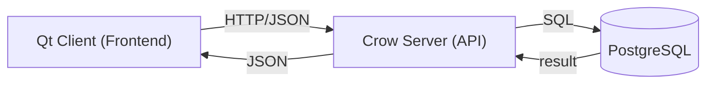

<p align="center">
  
</p>

#  
RoomSched — умное бронирование рабочих помещений


> Проект разрабатывается студентами ВШЭ (СПб) в рамках курса по C++.  
> Наша цель — создать удобную и быструю систему для бронирования переговорных, коворкингов и аудиторий.

---

## О проекте

RoomSched — это приложение для бронирования рабочих помещений.  
Оно подходит для:
- Офисов и бизнес-центров
- Университетских аудиторий
- Коворкингов и общественных пространств

### Особенности
- Просмотр зданий и помещений в 2D-режиме
- Бронирование на конкретное время
- Разделение на публичные и частные здания
- Загрузка конфигурации здания из JSON (для владельцев)
- Система фильтров и рекомендаций
- Возможность просмотра списка всех свободных и занятых помещений в пределах выбранного здания

### MVP
- Регистрация и вход (email + пароль)
- Просмотр списка зданий и комнат
- Бронирование комнаты с выбором даты и времени
- Проверка доступности комнаты на сервере

  .jpg) 

---

## Технологический стек

| Технология | Назначение |
|------------|------------|
| C++20 | Основной язык |
| Crow | REST API (сервер) |
| Qt 6 | Графический интерфейс (клиент) |
| PostgreSQL + libpqxx | База данных |
| nlohmann/json | Работа с JSON |
| CMake | Сборка проекта |
| Git / GitHub | Контроль версий |

---

## Архитектура



### Слои:
1. Клиент (Qt) — пользовательский интерфейс
2. Сервер (Crow) — REST API, бизнес-логика
3. База данных (PostgreSQL) — хранение пользователей, помещений, бронирований

---

## Установка и запуск

### Требования
- Компилятор с поддержкой C++17/20
- PostgreSQL 16+
- CMake 3.16+
- Qt 6 (для клиента)

### Серверная часть

#### 1. Настройка базы данных
```bash
sudo -u postgres psql -f backend/postgresql/db/create_database.sql
psql -U rsched_user -d roomsched -h localhost
PGPASSWORD='RschedUser87204576' psql -h localhost -U rsched_user -d roomsched -f backend/postgresql/db/create_tables.sql
```

#### 2. Сборка и запуск сервера
```bash
cd backend
cmake -S . -B build
cmake --build build
./build/server/server
```

### Клиентская часть (Windows)

```bash
cd frontend/client
rmdir /s /q build
mkdir build
cd build
cmake -G "Ninja" -DCMAKE_BUILD_TYPE=Release ..
cmake --build .
"C:\Qt\6.10.2\msvc2022_64\bin\windeployqt.exe" RoomSchedClient.exe
RoomSchedClient.exe
```

> Замените путь к Qt на ваш актуальный.

---

## Тестирование API

```bash
# Регистрация
curl -X POST http://localhost:8080/register \
  -H "Content-Type: application/json" \
  -d '{"username":"alex","password":"123456","email":"alex@test.com"}'

# Вход
curl -X POST http://localhost:8080/login \
  -H "Content-Type: application/json" \
  -d '{"username":"alex","password":"123456"}'

# Список всех пользователей
curl http://localhost:8080/get_users

# Список зданий
curl http://localhost:8080/buildings

# Комнаты здания
curl http://localhost:8080/buildings/1/rooms
```

---

## Структура проекта

```cpp
RoomSched/
├── backend/
│   ├── common/         # Общие структуры и утилиты
│   ├── database/       # Работа с БД (репозитории, сервисы)
│   └── server/         # Crow-сервер (API, обработчики)
├── frontend/
│   └── client/          # Qt-клиент (UI, ApiClient)
└── test_data/           # Тестовые данные
```

---

## Команда

<a href="https://github.com/cgsgag2/RoomSched/graphs/contributors">
  
</a>


---

## Ссылки

- [GitHub репозиторий](https://github.com/cgsgag2/RoomSched)

---
