<p align="center">
  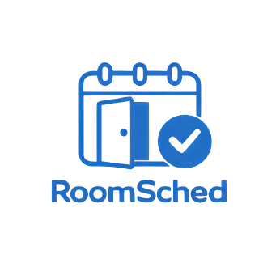
</p>

<h1 align="center">RoomSched</h1>

<p align="center">
Умное бронирование рабочих помещений
</p>

<p align="center">


</p>

<p align="center">
🇬🇧 <a href="./README.en.md">English Version</a>
</p>

---

## О проекте

**RoomSched** — десктопная система бронирования рабочих помещений, разработанная студентами НИУ ВШЭ (Санкт-Петербург).

Проект предназначен для быстрого поиска и бронирования помещений внутри образовательных учреждений: офисов, бизнес-центров и коворкингов.

Система позволяет пользователям находить подходящие помещения, создавать бронирования на выбранное время, управлять собственными бронированиями и получать уведомления через Telegram.

Архитектура приложения позволяет адаптировать систему под различные организации без существенных изменений клиентской и серверной частей.

---

## Содержание

* [Возможности](#возможности)
* [Скриншоты](#скриншоты)
* [Сценарий работы](#сценарий-работы)
* [Архитектура](#архитектура)
* [Технологический стек](#технологический-стек)
* [Структура проекта](#структура-проекта)
* [База данных](#база-данных)
* [Telegram-интеграция](#telegram-интеграция)
* [REST API](#rest-api)
* [Установка и запуск](#установка-и-запуск)
* [Тестирование](#тестирование)
* [Переменные окружения](#переменные-окружения)
* [Команда](#команда)
* [Лицензия](#лицензия)

---

# Возможности

### 📅 Бронирование помещений

Создание бронирований на выбранную дату и временной интервал с проверкой доступности помещения на стороне сервера.

### 🏢 Работа с несколькими зданиями

Система поддерживает произвольное количество зданий и помещений.

### 🔍 Фильтрация помещений

Поиск подходящих помещений с использованием системы фильтров.

### 📋 Управление бронированиями

Просмотр списка собственных бронирований и их отмена через интерфейс приложения.

### 📨 Telegram-уведомления

Получение уведомлений о создании и отмене бронирований через Telegram.

### 🔐 Аутентификация пользователей

Регистрация новых пользователей и вход в систему.

### ⚡ REST API

Клиент взаимодействует с сервером через REST API, построенный на Crow.

---

# Скриншоты

## Регистрация и аутентификация

<div style="display: flex; align-items: flex-start; gap: 15px;">
  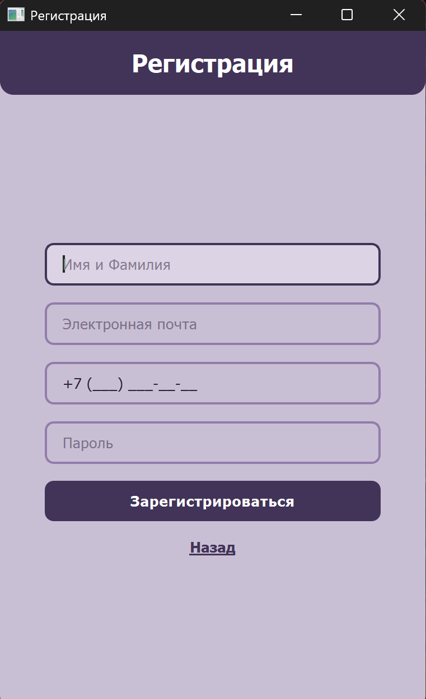
  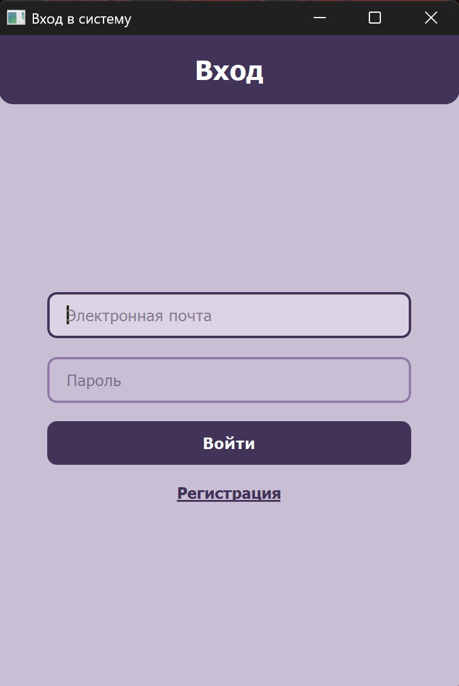
</div>

---

## Главное меню

<div style="align-items: flex-start;">
  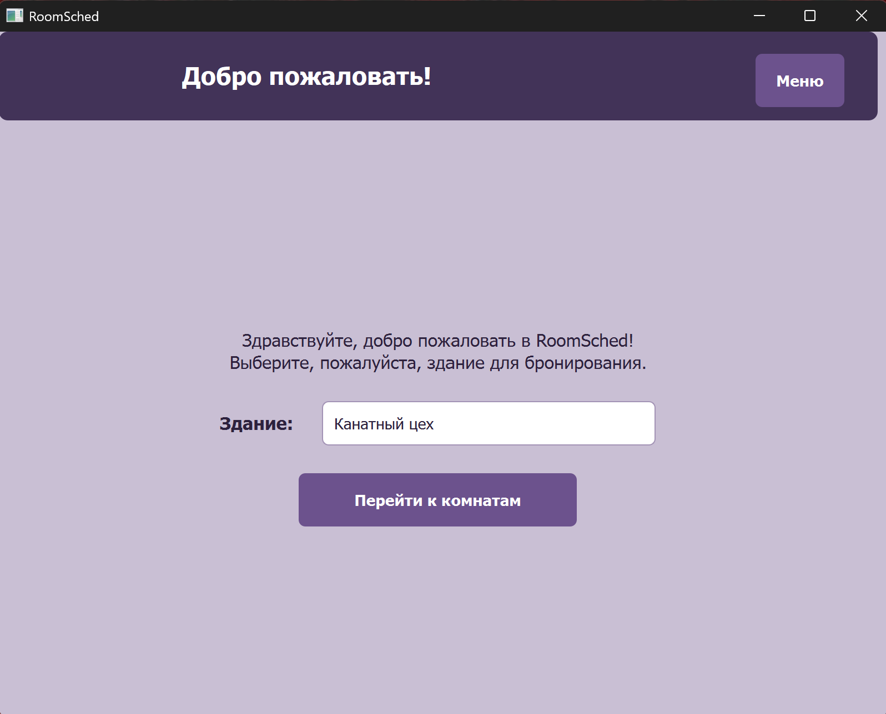
  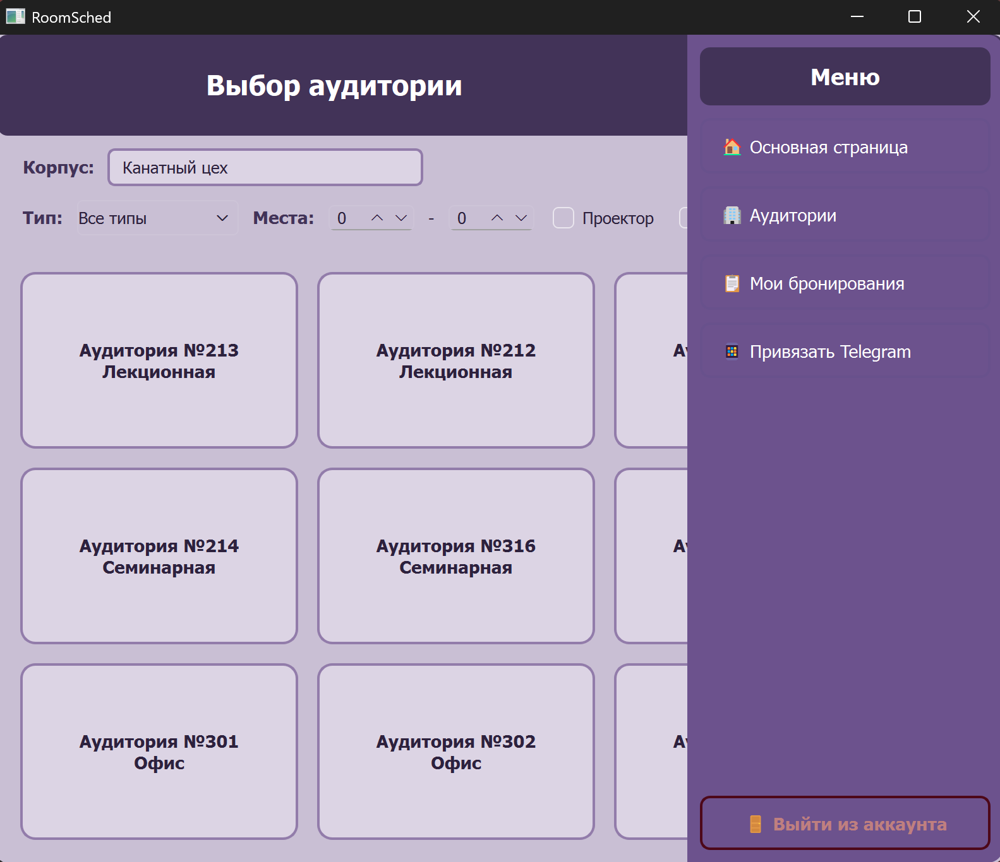
</div>

---

## Поиск и бронирование помещений

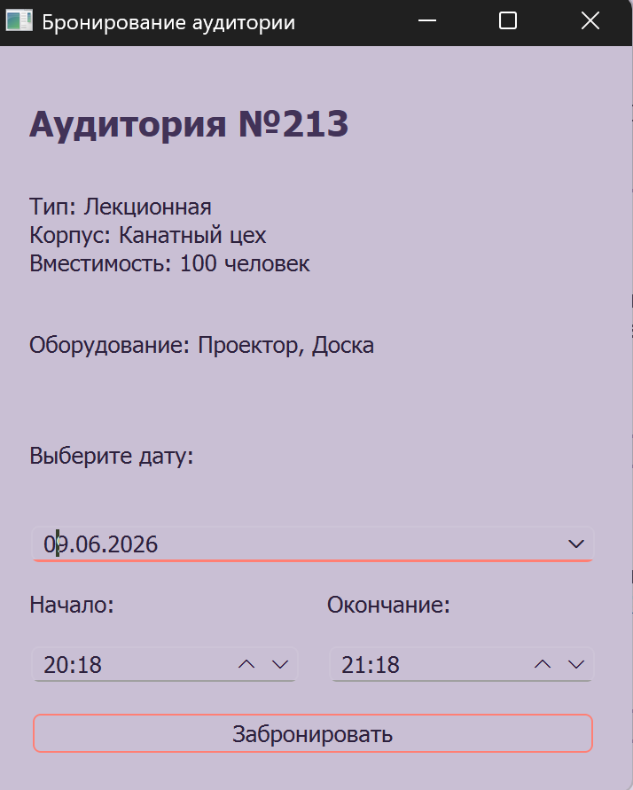

---

## Мои бронирования

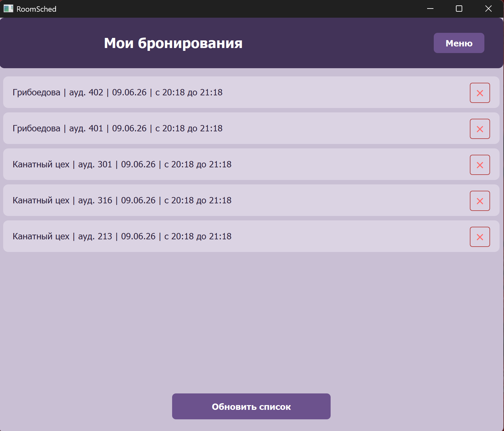

---

## Telegram

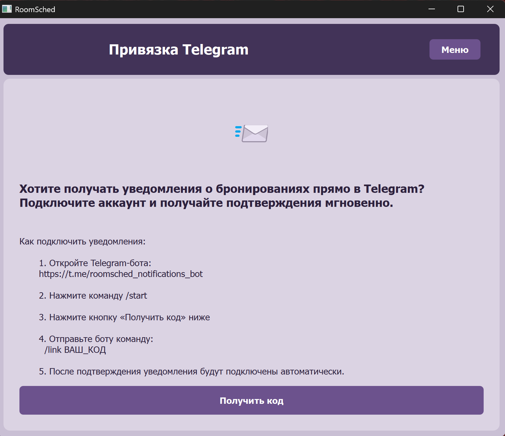

---

# Сценарий работы

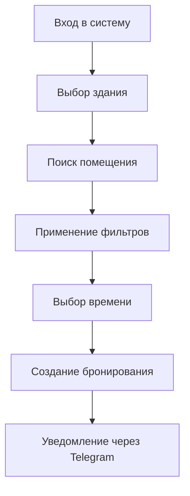
```mermaid
flowchart TD

A["Вход в систему"]
B["Выбор здания"]
C["Поиск помещения"]
D["Применение фильтров"]
E["Выбор времени"]
F["Создание бронирования"]
G["Уведомление через Telegram"]

A --> B
B --> C
C --> D
D --> E
E --> F
F --> G
```

---

# Архитектура

RoomSched построен по клиент-серверной архитектуре.

* Qt отвечает за пользовательский интерфейс;
* Crow предоставляет REST API;
* PostgreSQL хранит данные приложения;
* Telegram Bot используется для отправки уведомлений.

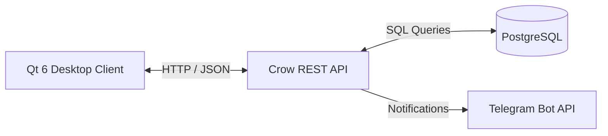
```mermaid
flowchart LR

Client["Qt 6 Desktop Client"]

API["Crow REST API"]

DB[("PostgreSQL")]

TG["Telegram Bot API"]

Client <-->|HTTP / JSON| API

API <-->|SQL Queries| DB

API -->|Notifications| TG
```

---

# Технологический стек

| Технология    | Назначение                            |
| ------------- | ------------------------------------- |
| C++20         | Основной язык разработки              |
| Qt 6          | Десктопный пользовательский интерфейс |
| Crow          | REST API сервер                       |
| PostgreSQL    | Хранение данных                       |
| libpqxx       | Работа с PostgreSQL                   |
| jwt-cpp       | JWT-аутентификация                    |
| bcrypt        | Хеширование паролей                   |
| nlohmann/json | Работа с JSON                         |
| cpr           | HTTP-клиент                           |
| Docker        | Развертывание backend                 |
| CMake         | Сборка проекта                        |
| Git / GitHub  | Контроль версий                       |

---

# Структура проекта

```text
RoomSched
│
├── backend
│   ├── common
│   │
│   ├── database
│   │   ├── db_sql
│   │   ├── include
│   │   │   ├── core
│   │   │   ├── models
│   │   │   ├── repositories
│   │   │   └── services
│   │   │
│   │   └── src
│   │       ├── core
│   │       ├── repositories
│   │       └── services
│   │
│   └── server
│       ├── include
│       │   ├── handlers
│       │   └── utils
│       │
│       └── src
│
├── frontend
│   └── client
│       ├── api
│       └── ui
│           ├── auth
│           ├── bookings
│           ├── menu
│           ├── register
│           ├── rooms
│           ├── side_panel
│           └── telegram
│
└── docker-compose.yml
```

---

# База данных

Основные сущности системы:

* Пользователи
* Помещения
* Бронирования
* Telegram-привязки
* Здания

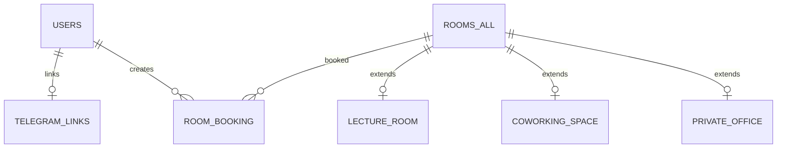
```mermaid
erDiagram

USERS ||--o| TELEGRAM_LINKS : links
USERS ||--o{ ROOM_BOOKING : creates

ROOMS_ALL ||--o| LECTURE_ROOM : extends
ROOMS_ALL ||--o| COWORKING_SPACE : extends
ROOMS_ALL ||--o| PRIVATE_OFFICE : extends

ROOMS_ALL ||--o{ ROOM_BOOKING : booked
```

---

# Telegram-интеграция

Для получения уведомлений пользователь может привязать Telegram-аккаунт к своей учетной записи RoomSched.

Процесс привязки:

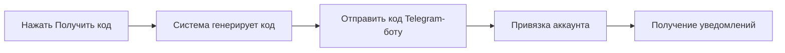
```mermaid
flowchart LR

A["Нажать Получить код"]
B["Система генерирует код"]
C["Отправить код Telegram-боту"]
D["Привязка аккаунта"]
E["Получение уведомлений"]

A --> B
B --> C
C --> D
D --> E
```

После привязки пользователь получает уведомления о:

* создании бронирования;
* отмене бронирования.

---

# REST API

## Аутентификация

| Метод | Endpoint     |
| ----- | ------------ |
| POST  | `/register`  |
| POST  | `/login`     |
| GET   | `/get_users` |

## Помещения

| Метод | Endpoint      |
| ----- | ------------- |
| GET   | `/rooms`      |
| GET   | `/rooms/{id}` |

## Бронирования

| Метод | Endpoint               |
| ----- | ---------------------- |
| POST  | `/book-room`           |
| GET   | `/bookings`            |
| GET   | `/bookings/user/{id}`  |
| GET   | `/bookings/rooms/{id}` |
| POST  | `/booking/{id}/cancel` |

## Здания

| Метод | Endpoint     |
| ----- | ------------ |
| GET   | `/buildings` |

## Telegram

| Метод | Endpoint         |
| ----- | ---------------- |
| POST  | `/telegram/link` |

---

# Установка и запуск

## Backend

Все команды выполняются из корня проекта.

### Первая сборка и запуск

```bash
docker compose up --build
```

### Запуск уже собранного backend

```bash
docker compose run --service-ports backend ./build/server/server
```

### Остановить контейнеры

При этом данные PostgreSQL сохраняются.

```bash
docker compose down
```

### Полностью удалить контейнеры и базу данных

```bash
docker compose down -v
```

### Подключиться к PostgreSQL

Посмотреть активные контейнеры:

```bash
docker ps
```

Подключиться к БД:

```bash
docker exec -it <container_name> psql -U rsched_user -d roomsched
```

---

# Тестирование

### Backend тесты

```bash
docker compose run --service-ports backend ./build/tests/backend_tests
```

### E2E тесты

```bash

```

---

# Запуск клиента

Перейдите в директорию:

```bash
cd frontend/client
```

## Linux

Сборка:

```bash
cmake -S . -B build
cmake --build build
```

Запуск:

```bash
./build/RoomSchedClient
```

## Windows

> Инструкция будет добавлена позже.

---

# Переменные окружения

Файл `.env`

```env
POSTGRES_USER=
POSTGRES_PASSWORD=
POSTGRES_DB=

DB_NAME=
DB_USER=
DB_PASSWORD=

TELEGRAM_BOT_TOKEN=
```

---

# Команда

<a href="https://github.com/cgsgag2/RoomSched/graphs/contributors">
  
</a>

---

# Лицензия

Проект распространяется по лицензии **MIT**.

Подробности доступны в файле `LICENSE`.

---

<p align="center">
Made with ❤️ and C++20 by HSE SPb students
</p>
